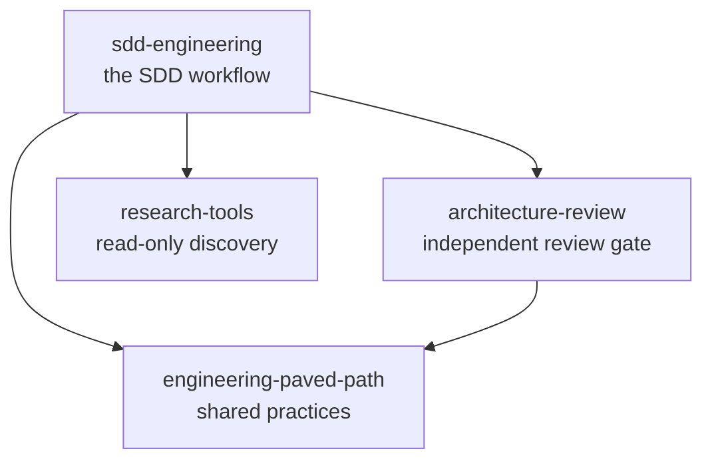

# Dependency graph

Which plugin depends on which, why each edge exists, and how a component in one
plugin is addressed from another.

The composition behind these boundaries is argued in
[COMPONENT-INVENTORY.md](COMPONENT-INVENTORY.md).

## The graph

```
sdd-engineering@1.0.0
├── engineering-paved-path@^1.0.0
├── research-tools@^1.0.0
└── architecture-review@^1.0.0
    └── engineering-paved-path@^1.0.0
```



Four plugins, four edges, two leaves, one diamond.

## Why each edge exists

| Edge | The call that creates it |
|---|---|
| `sdd-engineering` → `engineering-paved-path` | `implementation-planner` step 8 assigns each plan step the practice it runs under. It reads the path → practice mapping from `engineering-paved-path:skill-routing`; without it the step has no source and the planner invents one. |
| `sdd-engineering` → `research-tools` | `spec-creator` and `implementation-planner` delegate discovery rather than reading the repository themselves. A read-only agent is the whole point: discovery must not be able to edit. |
| `sdd-engineering` → `architecture-review` | The `run-plan` skill's review gate. A verdict from the agent that wrote the code is not a review, so the gate is a separate plugin with a separate owner. |
| `architecture-review` → `engineering-paved-path` | `architecture-reviewer` judges against a stated dependency rule. That rule is `engineering-paved-path:layered-architecture`; the reviewer applies it and does not restate it. |

## Why the leaves stay leaves

`engineering-paved-path` and `research-tools` depend on nothing, and that is an
invariant rather than a coincidence.

The direction of every edge is **workflow → practice**, never the reverse. A
practice skill that reached back into a workflow would close a cycle, and it
would also be wrong on its own terms: a repository that wants the layering rule
without the SDD workflow is a perfectly reasonable consumer, and both leaves have
consumers who never run the workflow at all.

`scripts/graph.mjs` walks the graph on every index build and fails on a cycle, so
the invariant is checked rather than remembered.

## The diamond

`engineering-paved-path` is reached twice: directly from `sdd-engineering`, and
again through `architecture-review`. Both edges carry the same range, so both
resolve to the same installed copy — one version on disk, one set of skills in
the session, one entry in `claude plugin list --json`.

This is what makes the range on each edge a real decision. If the two edges ever
carry ranges that no single version satisfies — `^1.0.0` on one and `^2.0.0` on
the other — the installer reports a **range conflict** and neither is installed.
Preventing that is a release-ordering rule, and it lives in
[RELEASES.md](RELEASES.md): dependencies release first, consumers second, and a
major bump in a leaf is a coordinated change across every plugin that reaches it.

## Namespaced references

Every component from a dependency is addressed as `<plugin>:<component>`.

An unqualified name resolves against whatever the host repository happens to have
installed. A host that defines its own `researcher` would silently win over
`research-tools:researcher`, and the workflow would run with an agent nobody in
this marketplace wrote. Namespacing is what makes an installed plugin behave the
same in every repository — the property the whole extraction exists to buy.

Use the full name for a plugin's own components too, wherever the field expects a
plugin-scoped reference.

### Roster

**`engineering-paved-path`** — three skills, released in 1.0.0:

| Reference | Consumed by |
|---|---|
| `engineering-paved-path:layered-architecture` | `architecture-review:architecture-reviewer` |
| `engineering-paved-path:frontend-architecture` | `sdd-engineering:implementation-planner` |
| `engineering-paved-path:skill-routing` | `sdd-engineering:implementation-planner`, step 8 |

**`research-tools`**

| Reference | Consumed by |
|---|---|
| `research-tools:researcher` | `sdd-engineering:spec-creator`, `sdd-engineering:implementation-planner` |

**`architecture-review`**

| Reference | Consumed by |
|---|---|
| `architecture-review:architecture-reviewer` | `sdd-engineering:run-plan`, as the review gate |

**`sdd-engineering`**

| Reference | Kind |
|---|---|
| `sdd-engineering:spec-creator` | agent |
| `sdd-engineering:implementation-planner` | agent |
| `sdd-engineering:implementer` | agent |
| `sdd-engineering:plan-verifier` | agent |
| `sdd-engineering:run-plan` | skill |
| `sdd-engineering:workflow-retro` | skill |
| `sdd-engineering:engineering-insights` | skill |

## Declaring a dependency

In `plugins/<name>/.claude-plugin/plugin.json`:

```json
{
  "name": "sdd-engineering",
  "version": "1.0.0",
  "dependencies": [
    { "name": "engineering-paved-path", "version": "^1.0.0" },
    { "name": "research-tools", "version": "^1.0.0" },
    { "name": "architecture-review", "version": "^1.0.0" }
  ]
}
```

Two range forms are allowed, and `scripts/graph.mjs` rejects any third:

- **A caret range** — `^1.0.0`. The default. Admits any release up to the next
  major.
- **An exact pin** — `1.0.0`. Only to work around a known broken release, and
  only with an issue open to remove it.

A range is not a wish. `^1.0.0` is a promise that every 1.x of that dependency
will keep this plugin working, and it is the reason a breaking change there is a
major bump rather than a judgement call.

## What goes wrong, and where it is caught

`claude plugin list --json` reports three failures after an install. Each has an
earlier place it could have been caught:

| Failure | Cause | Caught by |
|---|---|---|
| `dependency-unsatisfied` | A dependency no plugin in the marketplace provides — usually a typo, or a rename that missed a manifest | `npm run build:index`, before the pull request |
| `range-conflict` | Two paths into the diamond demand versions no single release satisfies | `npm run build:index`, and the release order in [RELEASES.md](RELEASES.md) |
| `no-matching-tag` | The version exists in a manifest but was never tagged, or the tag does not follow `<plugin>--v<version>` | The release checklist: dependencies are tagged and pushed before the consumer |

The first two are checked locally on every build. The third cannot be — it is a
fact about the remote — which is exactly why release order is a written rule
rather than a habit.

## Local check

```bash
npm run build:index
```

The build resolves the graph before writing anything, and fails on an unknown
dependency, a self-dependency, a cycle or an unsatisfiable range.

**As of the 1.0.0 release all four are at `1.0.0`, every range resolves, and the
build reports no notes.** What follows describes the mechanism, which still
applies to the next plugin scaffolded here.

While a dependency is still at `0.0.0` — scaffolded, never released — an
unsatisfied `^1.0.0` is reported as a note rather than an error:

```
note: sdd-engineering -> research-tools: requires ^1.0.0, research-tools is at 0.0.0 (unreleased)
```

Every manifest carries the placeholder until step 9, and every range already
points at the version it will be tagged with. The note becomes an error the
moment that dependency is released at a version the range excludes — the point
at which it would actually break somebody's install.

The resolved graph is written into `site/public/index.json` as `dependents` and
`resolvedDependencies` per plugin, so the catalog shows the transitive closure a
user is really installing rather than only the direct edges.
