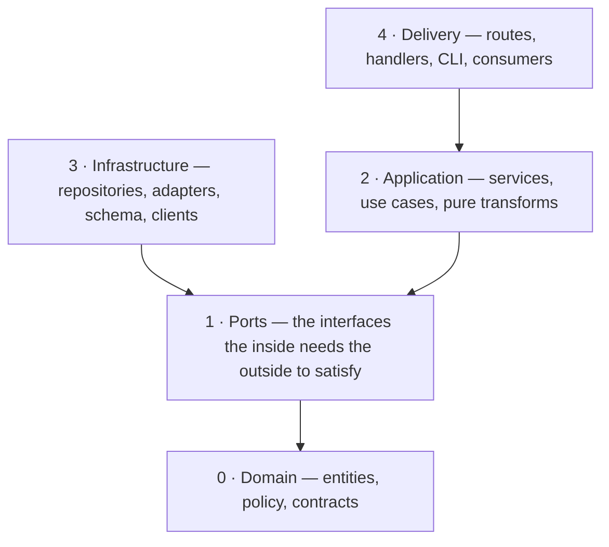

# Layered architecture

The dependency rule for server-side code, stated once so that everything which applies it —
reviews, plans, guards — can cite it instead of restating it.

Scope: server-side, domain and infrastructure code. For components, hooks, routes and the
server/client boundary in a UI, use `engineering-paved-path:frontend-architecture`.

## The rule

**Imports point inward.** Delivery may know the application layer, the application layer may
know ports, ports know only the domain. Nothing inward may know a web framework, an ORM, an
HTTP client or a concrete adapter class. The database is not the centre — it is external.



Everything else in this file is that sentence made decidable.

## The rings

The ring **names and roles** are stable across repositories. The **paths** are not.

| Ring | Role | Typically holds | May import | Never imports |
|---|---|---|---|---|
| 0 Domain | The rules that would survive replacing every tool in the stack | entities, value objects, policy, shared contracts | itself; at most a validation library | anything outward. No I/O at all |
| 1 Ports | The interfaces the inside needs the outside to satisfy | repository interfaces, adapter interfaces | ring 0 | any implementation |
| 2 Application | Decides *what happens*; orchestrates ports | services, use cases, orchestrators, pure transforms | rings 0–1, shared error types | an ORM, a web framework, a concrete adapter |
| 3 Infrastructure | Makes a port real | repositories, adapters, database schema, external clients | rings 0–1 | anything in ring 4 |
| 4 Delivery | Speaks a protocol | HTTP routes, handlers, CLI entry points, queue consumers, scheduled jobs | rings 0–2 | an ORM, the database schema, a concrete adapter |

**The composition root** — the container, the wiring module, the application entry point — is
allowed to see every ring at once. That is its job, not a violation. Everything else takes
its dependencies from the composition root, never by constructing a concrete class.

### Mapping the rings onto a repository

The rings are the rule; which directory is which ring is a fact about the repository, and
you get it in this order:

1. The repository's own architecture documentation, if it names its layers.
2. Its directory naming, where that is unambiguous — a `repositories/` next to an `adapters/`
   next to a `routes/` is a legible ring 3 / ring 3 / ring 4.
3. Nothing. Say so.

A mapping from step 2 is a **proposed** mapping. Label it as proposed, and do not raise a
blocking finding against a mapping the repository never agreed to. A mapping you could not
make at all is a question for the repository's owners, not a gap to fill by guessing.

## Where does this code go?

| The code… | goes to |
|---|---|
| speaks a protocol — status codes, headers, request/response objects, CLI arguments, a message envelope, streaming wiring | delivery |
| reads or writes the database, builds a query, touches the ORM | the persistence layer of the module that owns that data |
| shells out, calls a network API, reads the filesystem, reads the clock or the environment | an adapter, behind a port |
| is a pure transform over domain types — row → DTO, parse, format, rank, score | the application layer's helpers; the domain, if more than one entry point needs it |
| orchestrates several ports, or decides *what happens* | an application service; long-running work gets its own executor |

Still unsure? Ask **which ring would have to change if we swapped the database for something
else.** Whatever must not change belongs further in.

## Two legal module shapes

```
<module>/                          <module>/            ← thin module: nothing to orchestrate
  routes        protocol + validation    routes    protocol + validation
  service       orchestration            queries   the persistence access
  repository    persistence access
  helpers       pure transforms
  constants     literals
```

A module without a service is fine when there is nothing to orchestrate. A module with a
query **inside the protocol handler** is not. The missing service is a judgement call; the
inline query is the violation.

## Forbidden imports

Each one is a direction, not a package name. Substitute whatever this repository actually
uses; the direction is what is being judged.

1. **A persistence library or database driver imported outside the persistence layer** — or
   outside the schema module, the job runner and the entry point, if the repository declares
   those as exceptions.
2. **The database schema imported by a non-persistence file.** Row and record types may
   circulate inside the server if the repository says so; they stop at two borders — the
   protocol response (map to a DTO first) and anything shared with another deployable.
3. **A concrete adapter imported by an application-layer file.** Take the port off the
   composition root instead. Constructing a concrete client inside a service means it can no
   longer be swapped, and its test needs a network.
4. **A transport framework type crossing inward.** The protocol stops at delivery: pass
   primitives and DTOs, never the request or response object. When a service needs to log,
   it takes a narrow logger port, not the framework's request-scoped logger.
5. **Any inward import of a delivery file.** Only the composition root and the module's own
   barrel may import routes.
6. **Any I/O in ring 0** — no filesystem, no process spawning, no network, no database, no
   clock, no randomness. Its only side effects arrive through injected ports.
7. *(warning)* **A module importing a sibling module directly.** Cross-module reuse is
   brokered by the composition root or moved inward into shared domain code.

Business branching does not belong in a protocol handler either. `if (severity ===
'blocker')` belongs inward; `if (!row) throw new NotFound()` is translation, not a decision,
and stays at the edge.

## Exceptions are declared, not discovered

Every real codebase has a handful of deliberate exceptions — a shared row-types module
outside any single module, a compatibility shim, one endpoint whose body is validated inside
the handler because an empty body is legal there.

An exception is legitimate when it is **written down** in the repository's architecture
documentation, with the reason and the border it still respects. An exception that exists
only in the code is indistinguishable from a violation, and should be reported as one.

Do not "fix" a declared exception as a drive-by. Do not add a new one to unblock yourself.

## Keep it proportional

This is module-level layering, not per-entity DDD. Do not add a layer that only forwards
calls, an interface with exactly one implementation and no test seam, or a repository per
table.

The classic failure of a formally layered codebase is an **anemic domain** — rules scattered
across services while the model is a bag of fields. Prefer putting the decision next to the
data it governs over adding a new indirection.

Two more signals that the layering is wrong rather than the test:

- A test that needs three mocks to reach one assertion is usually testing a unit that sits
  in the wrong ring.
- A service test that needs a running database means infrastructure leaked into the service.
  Fix the layering; do not reclassify the test as an integration test.

## Read next

- Making the rule machine-checked, and the trap in reading a guard's exit code:
  [references/enforcement.md](references/enforcement.md)
- Sources and rationale: [references/sources.md](references/sources.md)
- The repository's own layer names, exceptions and invariants: its architecture
  documentation. This skill states the rule; that document states the dialect, and it wins
  wherever the two speak to the same question.
